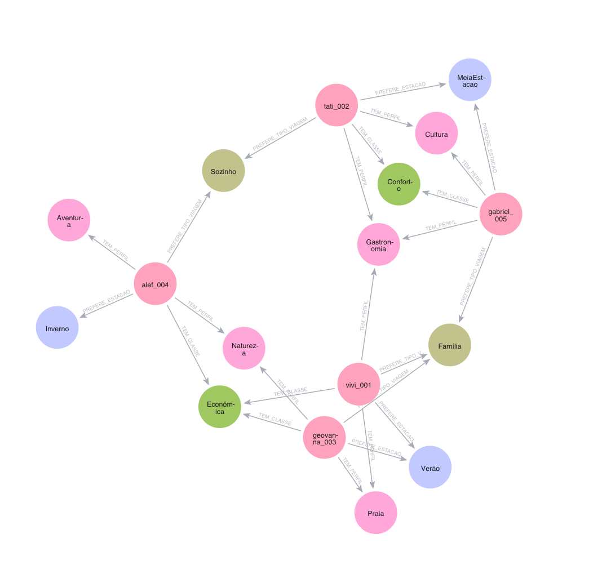

# adm-neo4j-travel-project
# Sistema de Recomendação de Destinos Turísticos com Grafos (Neo4j)

Este projeto implementa um **sistema de recomendação de destinos turísticos** utilizando **banco de dados em grafo (Neo4j)**.  
O objetivo é sugerir **cidades de viagem personalizadas** para clientes, considerando **perfil de interesse**, **classe econômica**, **estação preferida** e **tipo de viagem (sozinho ou em família)**.

---

## 🧠 Visão Geral da Solução

O modelo utiliza grafos para representar:

- Clientes e seus perfis de interesse
- Destinos turísticos (principais cidades da Europa)
- Classes econômicas
- Faixas de preço
- Estações do ano
- Tipos de viagem (Sozinho / Família)

A recomendação é baseada em um **score ponderado**, permitindo gerar um **ranking explicável de destinos** para cada cliente.

---

## 🧱 Modelagem em Grafo

### Principais Nós
- `Cliente`
- `Destino`
- `Pais`
- `Perfil` (Praia, Cultura, Gastronomia, etc.)
- `ClasseEconomica` (Econômica, Conforto, Luxo)
- `FaixaPreco` (Baixo, Médio, Alto)
- `Estacao` (Verão, Inverno, MeiaEstacao)
- `TipoViagem` (Sozinho, Família)

### Principais Relacionamentos
- `(:Cliente)-[:TEM_PERFIL {peso}]->(:Perfil)`
- `(:Destino)-[:COMBINA_COM {score}]->(:Perfil)`
- `(:Cliente)-[:TEM_CLASSE]->(:ClasseEconomica)`
- `(:Destino)-[:RECOMENDADO_PARA]->(:ClasseEconomica)`
- `(:Destino)-[:TEM_FAIXA_PRECO]->(:FaixaPreco)`
- `(:Destino)-[:NO_PAIS]->(:Pais)`
- `(:Cliente)-[:PREFERE_ESTACAO]->(:Estacao)`
- `(:Destino)-[:MELHOR_EM]->(:Estacao)`
- `(:Cliente)-[:PREFERE_TIPO_VIAGEM]->(:TipoViagem)`
- `(:Destino)-[:IDEAL_PARA]->(:TipoViagem)`

---

## 📁 Estrutura do Repositório

    ├── cypher/
    │ ├── 1_setup.cypher
    │ ├── 2_populate.cypher
    │ └── 3_recommendation.cypher
    ├── images/
    │ └── visualisation.png
    └── README.md

---

## ▶️ Scripts Cypher

### 1️⃣ `1_setup.cypher`
Responsável por:
- Criar **constraints**
- Criar nós de **dimensão** (classes, perfis, estações, tipos de viagem)

📌 Deve ser executado **primeiro**.

---

### 2️⃣ `2_populate.cypher`
Responsável por:
- Criar **clientes fictícios**
- Associar perfis, pesos, classe econômica, estação e tipo de viagem
- Criar **principais cidades da Europa**
- Classificar destinos por preço, classe econômica, perfis e estação

📌 Executar após o setup.

---

### 3️⃣ `3_recommendation.cypher`
Contém apenas **queries de recomendação**, incluindo:
- Top 3 cidades para cada cliente
- Top 3 considerando tipo de viagem automaticamente
- Top 3 para viajar sozinho
- Top 3 para viajar em família
- Query explicativa do “por que” um destino foi recomendado

📌 Pode ser executado quantas vezes quiser (apenas leitura).

---

## 🎯 Regra de Recomendação

O sistema calcula um **score total** para cada destino com base na fórmula:

Score Total =
Σ (peso do perfil do cliente × score do destino)

bônus de estação

### Regras aplicadas:
- ✅ Compatibilidade de perfil (ponderada)
- ✅ Filtro por classe econômica
- ✅ Bônus se a estação preferida coincide com a melhor estação do destino
- ✅ Filtro por tipo de viagem (Sozinho ou Família)
- ✅ Ranking final ordenado por score

---

## 🧪 Visualização do Grafo

O repositório inclui uma imagem do **grafo resultante**, após a execução dos scripts:

---

## 🛠️ Tecnologias Utilizadas

- **Neo4j** (Banco de Dados em Grafo)
- **Cypher Query Language**
- **Neo4j Browser / Neo4j Desktop**

---

## 📌 Observações Finais

- O modelo é **extensível**, permitindo inclusão de:
  - orçamento real
  - histórico de viagens
  - hotéis e voos
  - penalização de destinos repetidos
- O sistema prioriza **explicabilidade**, ideal para uso acadêmico ou demonstração técnica.

---

## ✨ Autoria
<table>
  <tr>
    <td align="center">
      
       
      <b>Viviane Corrêa</b>
       
      <a href="https://github.com/vivianecorrea">GitHub</a>
    </td>
    <td align="center">
      
       
      <b>Tatiane Silva</b>
       
      <a href="https://github.com/tatiane-ss">GitHub</a>
    </td>
  </tr>
</table>
